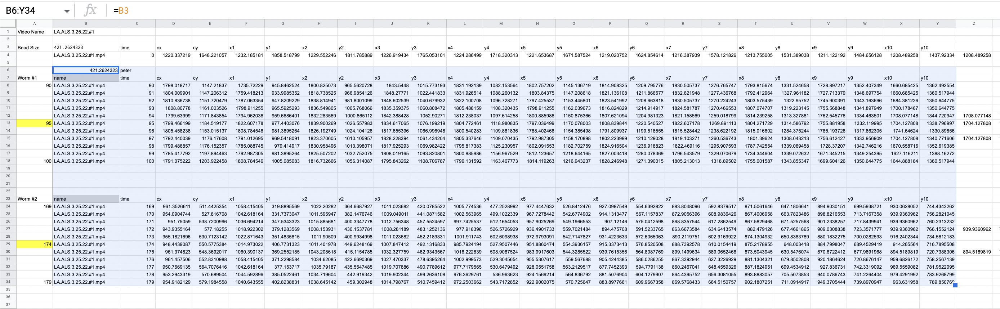

# worm-distancer
Gotta keep your worms distanced, man.

😎

## Using this repo

1. Start by using the `index.html` web interface to annotate the worms. Paste the skeletal points into a spreadsheet to save the data temporarily. You will later clean up the data before copying out of the spreadsheet and into a folder for processing.
2. Clean up the data: align the pasted blocks in the spreadsheet with at least two blank rows between each line (the script splits by '\n\n')
3. Add metadata: above the first block of skeletal points, add the bead diameter in the left-most cell and the annotator name to the right (see image)

4. Copy the relevant data out. Each block of skeletal points (separated by two empty rows) will be parsed out, scaled by the scaling factor in the top left corner, and tagged with the author name provided.
5. See the `if __name__ == '__main__'` block in [./process/compare.py](./process/compare.py) for more notes on how to modify and operate the comparison script, and export charts.
